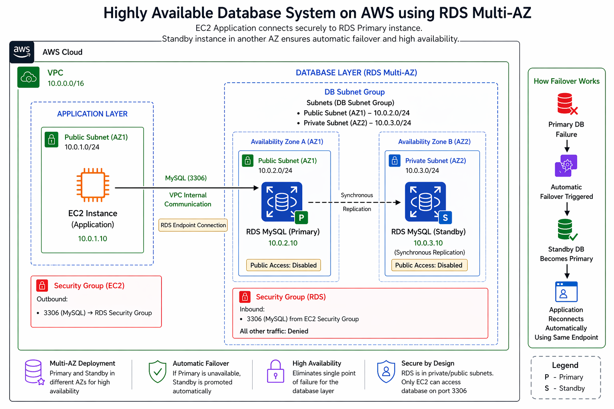

# 🚀 Highly Available Database System on AWS using RDS Multi-AZ

Designing a **fault-tolerant, production-ready database architecture** with automatic failover, secure networking, and zero manual intervention.

---

## 🌐 System Overview

This project demonstrates how to build a **highly available database system** on AWS using **Amazon RDS Multi-AZ**, securely integrated with an EC2 application.

It is designed with a **production mindset**, ensuring:

* High availability
* Automatic failover
* Secure communication
* Zero single point of failure

---

## 🏗️ Architecture



### 🔍 Key Highlights

* **Multi-AZ Deployment**
  Primary and standby databases deployed across different Availability Zones

* **Automatic Failover**
  Standby instance is promoted automatically during failure

* **Managed Endpoint Abstraction**
  Application connects using a single RDS endpoint (no reconfiguration required)

* **Secure by Design**
  Database is not publicly accessible — only EC2 can connect via security groups

* **VPC Internal Communication**
  All traffic stays within AWS network (no public exposure)

---

## ⚙️ Tech Stack

* **AWS EC2** — Application Layer
* **AWS RDS (MySQL)** — Database Layer
* **Amazon VPC** — Networking
* **Security Groups** — Access Control
* **Multi-AZ Deployment** — High Availability

---

## 🧠 Problem Solved

Traditional database setups suffer from:

* ❌ Single point of failure
* ❌ Downtime during crashes
* ❌ Manual recovery delays

### ✅ Solution

This system ensures:

* ✔ Automatic failover within seconds
* ✔ Zero data loss using synchronous replication
* ✔ Continuous application availability
* ✔ No manual intervention required

---

## 🔄 How It Works

1. EC2 application connects to RDS via a **managed endpoint**
2. Primary database handles all traffic
3. Standby database remains in sync (real-time replication)
4. On failure → AWS promotes standby automatically
5. Application reconnects using the same endpoint

---

## 🔐 Security Architecture

* RDS deployed with **public access disabled**
* Only EC2 security group allowed on **port 3306**
* No internet exposure to database
* Principle of **least privilege enforced**

---

## ✅ Validation & Testing

* ✔ RDS instance successfully deployed and available
* ✔ Multi-AZ configuration verified
* ✔ EC2 → RDS connection tested
* ✔ Security group restrictions validated

---

## 📂 Project Structure

```bash
.
├── architecture/
│   ├── ARCH_main.png
│   └── README.md
│
├── database/
│   ├── create_table.py
│   ├── show_tables.py
│   └── README.md
│
├── scripts/
│   ├── create_table.py
│   └── show_tables.py
│
├── screenshots/
│   └── README.md
│
├── documentation/
│   ├── Highly-Available-Database-System-on-AWS (3).pdf
│   └── README.md
│
└── README.md
```

---

## 📄 Documentation

For detailed explanation of architecture, design decisions, and validation:

👉 [View Full Documentation](./documentation/Highly-Available-Database-System-on-AWS%20%283%29.pdf)

---

## 🎯 Key Takeaways

* High availability is a **core requirement**, not optional
* Managed services simplify complex infrastructure
* Security must be designed from the beginning
* Systems should be built to **handle failures automatically**

---

## 💡 What This Project Demonstrates

* Real-world AWS architecture design
* Strong understanding of high availability concepts
* Secure cloud networking practices
* Production-level system thinking

---

## 🚀 Final Thought

> This project goes beyond deployment — it demonstrates how to design systems that **remain resilient under failure**, reflecting real-world engineering practices.

---

## 👨‍💻 Author

**Adhithyan Sivaraman T**
🔗 LinkedIn: https://www.linkedin.com/in/adhithyan-sivaraman-t-399b5b362/  

🔗 GitHub: https://github.com/Adhithyan-10

---

⭐ If you found this project valuable, feel free to connect or explore more!
